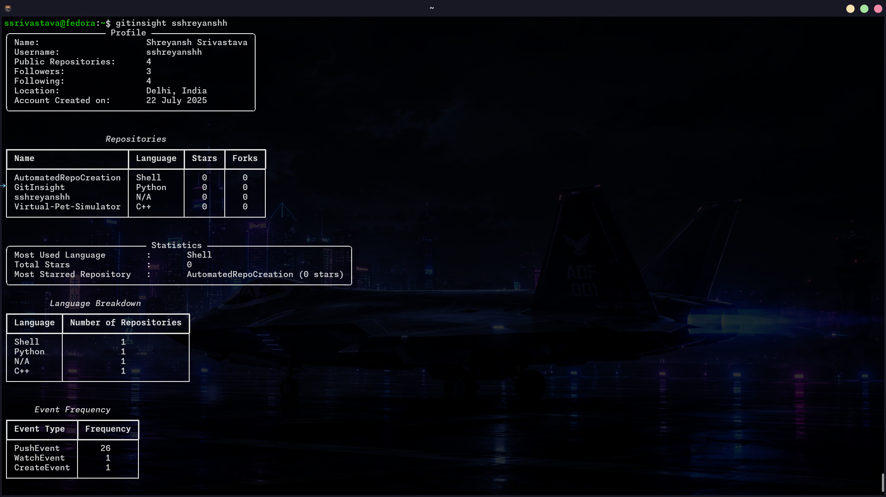
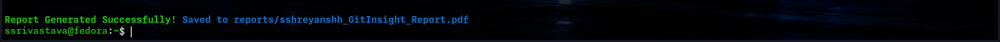
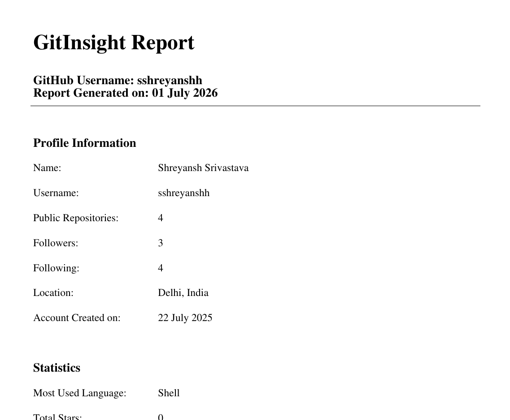

<div align="center">

# GitInsight <sub>`v1.1.0`</sub>

A high-performance CLI tool for analyzing GitHub user profiles and generating meaningful insight reports.
<br>


<br>
<br>


<br>
</div>

---

Engineered with asynchronous Python to ensure rapid data retrieval without rate-limiting bottlenecks, GitInsight provides developers and recruiters with an immediate, deep-dive view into any GitHub footprint directly from the terminal.

<br>

## Contents
* [Features](#features)
* [Installation](#installation)
* [Configuration](#configuration)
* [Usage](#usage)
* [Architecture & Technology Stack](#architecture--technology-stack)
* [Preview](#preview)
* [Local Development](#local-development)
* [Changelog](#changelog)
* [License](#license)

<br>

## Features
* **Asynchronous Data Retrieval:** Utilizes `aiohttp` and `asyncio` to concurrently fetch user profiles, repositories, and recent events, significantly reducing wait times.
* **Terminal User Interface (TUI):** Powered by `rich`, featuring live loading indicators, color-coded data tables, and formatted statistical outputs for maximum readability.
* **Automated PDF Generation:** Instantly compile a user's GitHub statistics and repository data into a clean, exportable PDF report.
* **Secure Credential Management:** Securely caches your GitHub Personal Access Token locally with restricted permissions.

<br>

## Installation
GitInsight is available on the Python Package Index (PyPI). It requires Python 3.8 or higher. 

Install the package globally using pip:
```bash
pip install gitinsight-py
```

<br>

## Configuration

By default, GitInsight does not require a GitHub Personal Access Token. This allows upto 60 requests per minute.

To bypass standard GitHub API rate limits, add a token by using:
```bash
gitinsight --token TOKEN
```

To remove the saved token and fall back to unauthenticated requests, run:
```bash
gitinsight --clear-token
```
This removes the cached `~/.gitinsight` file; any `GITHUB_TOKEN` from your shell or `.env` file still takes precedence.

### Getting Your Token

1. Go to [GitHub Settings → Developer Settings → Personal Access Tokens → Tokens (Classic)](https://github.com/settings/tokens)
2. Click **"Generate new token (classic)"**
3. Give it a name: `gitinsight`
4. Set expiration: 90 days or no expiration
5. Select these scopes:
   - `read:user`
   - `public_repo`
6. Click **"Generate token"**
7. Copy it immediately — GitHub shows it only once

<br>


The token is securely stored in your local home directory (`~/.gitinsight`). You may also provide the token via a local `.env` file or by exporting `GITHUB_TOKEN` to your system environment variables.

<br>

## Usage

Once installed, the `gitinsight` command is registered globally on your system.

**Basic Profile Analysis:**
Execute the command followed by the target GitHub username.
```bash
gitinsight sshreyanshh
```

**Generate a PDF Report:**
Append the `-r` or `--report` flag to automatically generate and save a PDF summary in your current working directory.
```bash
gitinsight sshreyanshh -r
```

**Enable Verbose Logging:**
Append the `-v` or `--verbose` flag to view underlying API requests and debugging information.
```bash
gitinsight sshreyanshh -v
```

<br>


## Architecture & Technology Stack

* **Language:** Python 3.8+
* **Asynchronous Networking:** [aiohttp](https://docs.aiohttp.org/)
* **Terminal Formatting:** [Rich](https://rich.readthedocs.io/)
* **Document Generation:** [fpdf2](https://pyfpdf.github.io/fpdf2/)
* **Build System:** [Hatchling](https://hatch.pypa.io/)

<br>

## Preview

`gitinsight <username>` (for insight without report) <br>

<br>
<br>
`gitinsight <username> --report` (for insight with report, snapshot of additional message displayed.)

<br>
<br>
(sample of report generated via GitInsight)
<br>


<br>

## Local Development

To run the project locally for development or contribution:

1. Clone the repository.
   ```bash
   git clone https://github.com/sshreyanshh/GitInsight.git
   ```
2. Navigate to the project root directory.
3. Install the package in editable mode:
   ```bash
   pip install -e .
   ```
<br>

## Changelog
### v1.1.0
- Added unauthenticated mode (no token required)
- Added --token flag to set GitHub PAT directly
- Added --clear-token flag to remove saved PAT
- Fixed token loading when running from any directory
- Improved rate limit error handling
### v1.0.2
- Improved error handling with specific exception types
### v1.0.1
- Fixed crash when entering a nonexistent GitHub username
### v1.0.0
- Initial release
  
<br>

## License

This project is open-source and available under the standard MIT License.

<br>


<p align="center">
<br>
<b>Developed by Shreyansh Srivastava · 2026</b>
</p>
